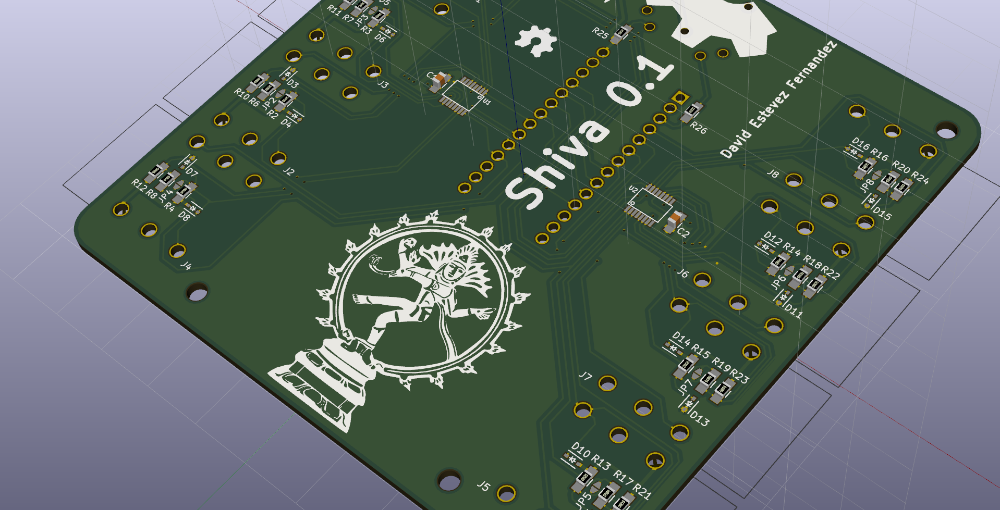
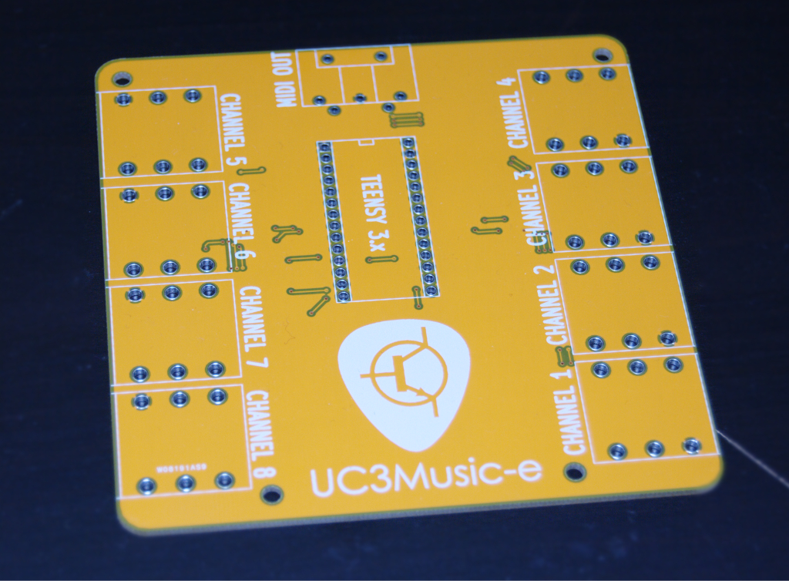
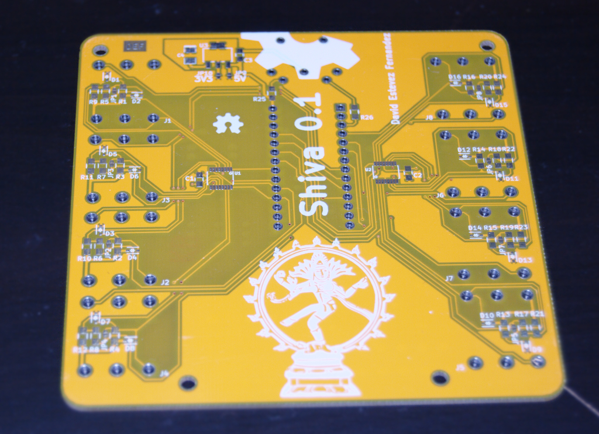

Shiva
--------------------------
Up to 8 piezo sensors with MIDI out (standard and USB) to make an electronic drumset

## v0.1 Prototype
### PCBs

## Proof of concept

Proof of concept done with an Arduino Micro board (click on the images below to go to the videos):

# Acknowledgments

 * Inspired by KORG's [CLIPHIT](http://www.korg.com/us/products/drums/cliphit/)
 * Conditioning circuit for piezo sensors is based on [ScienceProg's circuit](http://www.scienceprog.com/thoughts-on-interfacing-piezo-vibration-sensor/)

# Credits
* Author: [David Estevez Fernandez](https://github.com/David-Estevez)
